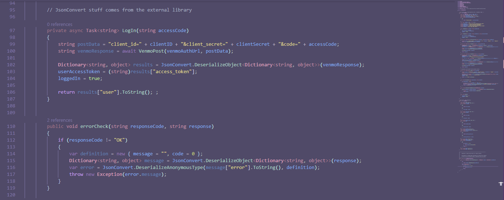
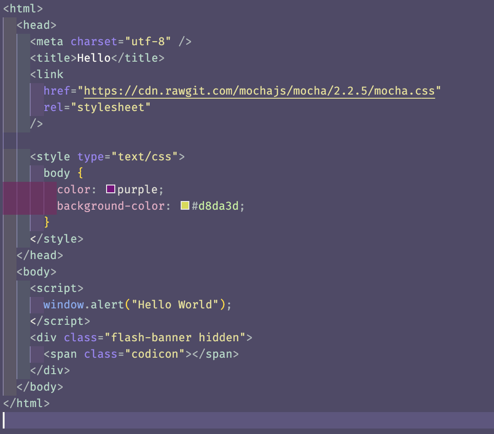
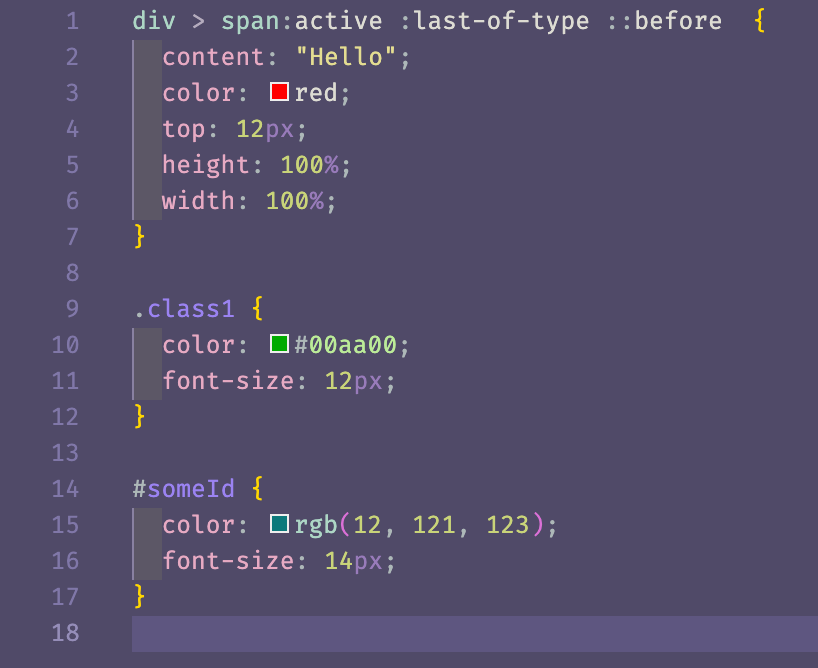
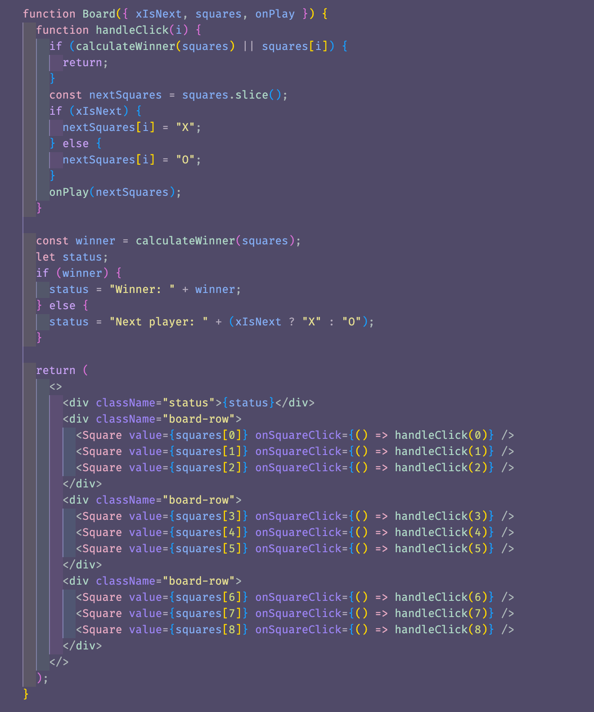
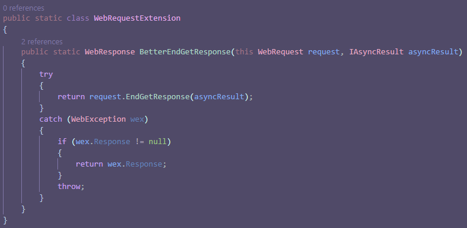
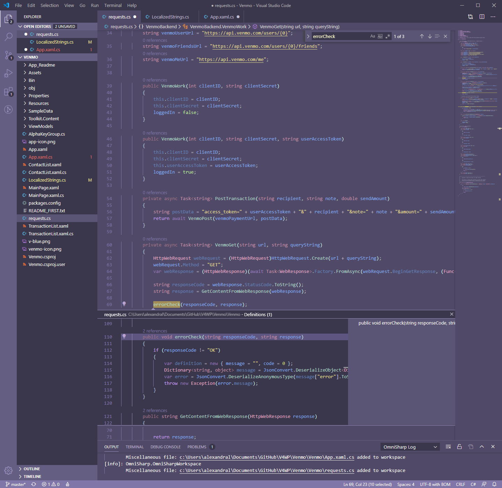

# Astrolize++ VSCode Theme

This theme just [Astrolize](https://github.com/spara-joy/Astrolize-VScode-Theme) with some extra config options to make syntax highlighting work better for web development.
It includes all of the special C# config that Astrolize does, plus some new stuff for html, css, and jsx.

### HTML

### CSS

### JSX/TSX

## From original README.md:

### C# styling with a purpose

Colors have different levels of saturation and tint to describe the scope and meaning of each part of the code.

### Supports GitLens, Intellisense, and Peek in full color theme

